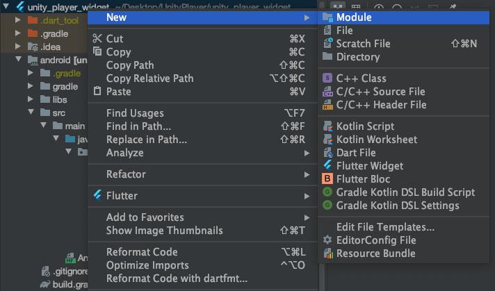
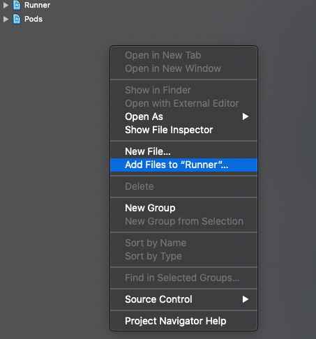
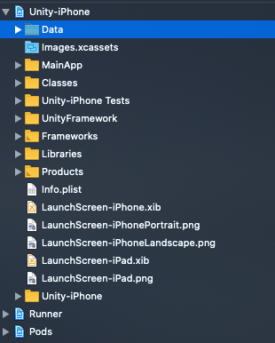
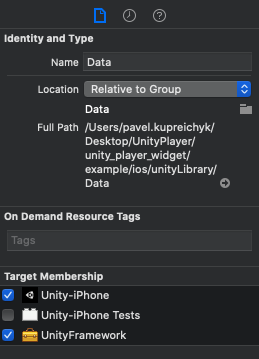
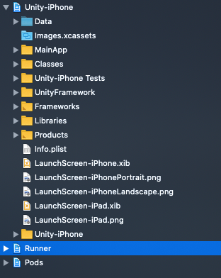
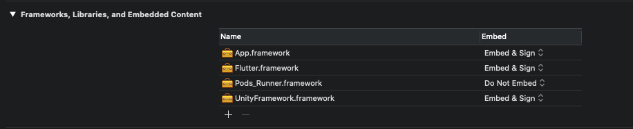
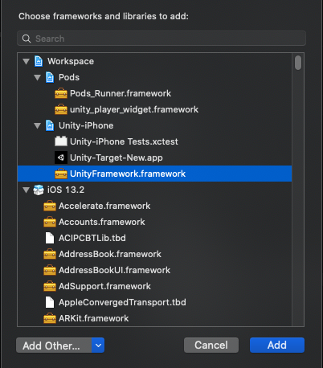

# unity_player_widget

A plugin that allows you to embed a Unity project in Flutter.

# How to install
## Preparation
0. Add unity_player_widget plugin to your Flutter project.
1. Create a Unity project (or use existed).
2. Download [Editor folder](https://github.com/Pavel-Kupreichyk/unity-player-widget/tree/master/Editor) and add it to your unity project.
2. Create a folder named "unity" in the Flutter project.
3. Move created Unity project to "unity" folder. 

Your flutter project folder should look like this: 
**-android 
-ios 
-lib 
-test 
-unity 
   └{Your Unity Project} 
-pubspec.yml 
-README.md **

## Android
1. In Unity project go to File->Build settings
2. Add at least 1 scene to the project
3. Go to android Player Settings 
  **Unity player settings: 
    Scripting Backend -> IL2CPP 
    ARMv7 -> TRUE 
    ARM64 -> TRUE **
4. Select UnityPlayerWidget->Export Android
5. In Flutter project go to android/unityLibrary/libs and create package for every aar or jar file in the folder.
(If you use AndroidStudio, just right-click to your project, select New->Module->{Import .JAR/.AAR Package} and find aar or jar file in the libs folder). 

6. Move all created packages into android folder. 
7. Go to android/unityLibrary/build.gradle 
- Remove this line: 
<pre>// GENERATED BY UNITY. REMOVE THIS COMMENT TO PREVENT OVERWRITING WHEN EXPORTING AGAIN</pre>

- Replace all dependencies by **implementation project(':[Name of created package]')** 
Your dependencies should look like this: 
<pre>
dependencies {
    implementation project(':package1')
    implementation project(':package2')
    implementation project(':package3')
    implementation project(':package4')
}
</pre>
- Add buildTypes to android section: 
<pre>android {
	//**//
	buildTypes {
		profile { matchingFallbacks = ['debug', 'release'] }
	}
}
</pre>
8. Go to android/settings.gradle 
- Include all created packages (first line of the file) 
Your include section should look like this: 
<pre>
include ':app', ':package1', ':package2', ':package3', ':package4'
</pre>
- Add this to the end of the file:
<pre>
include ":unityLibrary"
project(":unityLibrary").projectDir = file("./unityLibrary")
</pre>
9. minSdkVersion in android/app/build.gradle and android/unityLibrary/build.gradle must be equal.
## iOS
1. In Unity project go to File->Build settings
2. Add at least 1 scene to the project
3. Go to iOS Player Settings 
  **Unity player settings: 
    Scripting Backend -> IL2CPP 
    ARMv7 -> TRUE 
    ARM64 -> TRUE **
4. Select UnityPlayerWidget->Export iOS.
5. Open Runner.xcworkspace with Xcode and add ios/unityLibrary/Unity-iPhone.xcodeproj to "Runner".

6. Add Data folder to the UnityFramework in the Target Membership section. 

7. Add UnityFramework to "Runner". 

